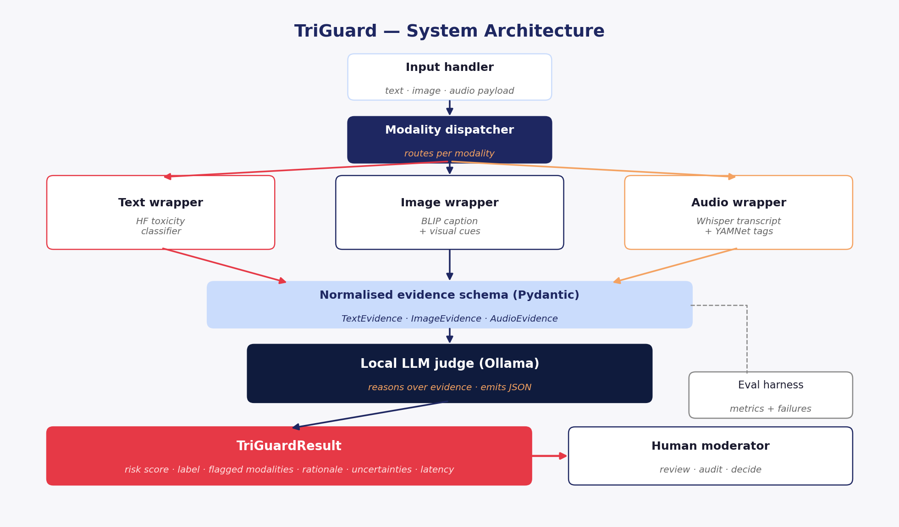

# Chapter 1 — Introduction

## 1.1 Project Concept

TriGuard is a prototype, locally deployable content-moderation pipeline that combines several pre-trained Artificial Intelligence models — one for text, one for image and one for audio — with a local Large Language Model (LLM) that acts as a judge. For each piece of content the system produces a single structured decision containing a risk score, a risk label (safe, borderline or harmful), the modalities that contributed to the decision, a short human-readable rationale, and a recommended action (allow, review or block).

The project deliberately frames moderation as an *orchestration* problem rather than a single-model classification problem. Each modality is handled by a specialised model that is good at that signal; an explicit orchestration layer collects their structured evidence; and an LLM judge then reasons over that evidence and produces an output that a human moderator can read and audit. Throughout the report TriGuard is positioned as decision-support, not autonomous moderation: every output is intended for human review.

## 1.2 Motivation

Online platforms now host text, images and audio side by side. Harmful content increasingly crosses these modalities — for example, a meme that pairs a benign caption with a hateful image, or a polite voice note over a violent visual — and tools that look at one signal at a time miss exactly these cases (Kiela et al., 2020). The volume problem makes this worse: human moderators cannot keep up, and the most widely-used automated services either look at a single modality or run as closed cloud APIs that smaller platforms cannot inspect or self-host (Gorwa, Binns and Katzenbach, 2020). Two specific gaps motivate this project.

The first is **multimodal coverage**. Strong systems exist for text moderation (Lees et al., 2022), for image–text fusion benchmarks (Kiela et al., 2020) and for audio recognition (Gemmeke et al., 2017; Radford et al., 2023), but they are usually deployed in isolation. A platform that needs to act on a post containing all three modalities has to glue these systems together itself, often without a shared evidence format.

The second is **explainability and locality**. New regulation in the United Kingdom and the European Union is encouraging platforms toward transparency: the Online Safety Act and the Digital Services Act are widely read as expecting moderation decisions to come with statements of reasons that humans can audit. At the same time, the most accurate automated moderation services run in the cloud and require sending user content to a third party, which is not always acceptable for privacy-sensitive deployments. Recent work on LLM-as-a-judge methods (Zheng et al., 2023) shows that strong language models can produce useful written rationales when given structured evidence, which suggests a way to satisfy the explanation requirement using locally-hosted weights.

TriGuard responds to both gaps in a small, focused way. The user groups the design assumes are: human moderators who need structured evidence rather than a single number; trust-and-safety teams at small and medium platforms that cannot afford enterprise APIs; researchers and non-governmental organisations studying online harm who need auditable tools; and forum operators with privacy-sensitive content who cannot send data to a third-party cloud. Because the prototype is not aimed at end users posting content, ethical risk is minimised: the system is an internal tool and its decisions are always advisory.

## 1.3 Template

The project is built on the **CM3020 Artificial Intelligence** template, *Project Idea 1: Orchestrating AI Models to Achieve a Goal*. The template asks for the use of multiple pre-trained models combined toward a clearly defined objective. TriGuard satisfies this in a direct way: four established models — a text toxicity / sentiment classifier, an image captioner (BLIP), an audio speech-to-text system (Whisper) plus an audio event tagger (YAMNet), and a local instruction-tuned LLM as judge — are composed inside an explicit orchestration layer, and the goal is a single auditable moderation decision per piece of content. Only a small text classifier is trained from scratch, on a tiny bundled corpus. The interesting engineering is in the orchestration layer: defining a shared evidence schema, building an LLM judge that produces structured output, handling invalid output gracefully and evaluating the whole pipeline end-to-end.

This choice keeps the project tractable within a single CM3070 timeline while still meeting the template's intent. It also preserves auditability of each model's contribution — a property that is hard to achieve when one large fusion model is trained against an end-to-end objective — and makes individual models swappable without retraining.

## 1.4 Structure of this Report

The remainder of the preliminary report is organised into three further chapters, each developed during a separate phase of the project. **Chapter 2** is a revised version of the literature review previously submitted for peer review. It covers eight sources spanning text moderation, image–text fusion, audio recognition, the LLM-as-judge paradigm and the governance of automated moderation, and ends with a research gap that TriGuard is designed to address. **Chapter 3** is a revised version of the project design document. It explains the user-need-driven design choices, the system architecture, the technologies and methods chosen, a 24-week work plan with contingencies, the evaluation strategy, and the inclusive and ethical considerations that frame the work. **Chapter 4** is the feature prototype: it describes the Tier-A implementation that has been built, the evaluation approach used, the results observed so far, and the limitations and improvements that the prototype has surfaced. A short demonstration video accompanies that chapter and is referenced where appropriate.

# Chapter 2 — Literature Review

## 2.1 Introduction

Online platforms now host text, images, audio and video side by side, and harmful content frequently spans more than one modality at once (Kiela et al., 2020). Traditional automated moderators were designed to score a single signal — most commonly text — and struggle when a meme combines a benign caption with a hateful image, or when an innocuous post is wrapped around violent audio (Gorwa, Binns and Katzenbach, 2020). This survey reviews the work that informs **TriGuard**, a prototype CM3070 project that orchestrates three pre-trained perception models with a local Large Language Model (LLM) judge to produce a single, explainable moderation decision across text, image and audio. The review covers eight sources across text moderation, multimodal fusion, audio recognition, the LLM-as-judge paradigm, vision–language pre-training and the governance of algorithmic moderation. Each thematic section closes with a comparison paragraph that points toward the research gap TriGuard addresses.

## 2.2 Search Strategy and Selection Criteria

Sources were retrieved from the University of London Online Library, Google Scholar, the ACM Digital Library, the NeurIPS and ICML proceedings, and arXiv, using combinations of *content moderation*, *toxicity detection*, *multimodal hate speech*, *hateful memes*, *audio event detection*, *LLM-as-judge*, *explainable AI* and *algorithmic moderation*. Inclusion criteria were: (i) peer-reviewed or widely cited preprint with verifiable open weights, (ii) published 2017–2023, and (iii) contributes either a method TriGuard plans to use, a benchmark to evaluate against, or governance framing. Blog posts and product pages were excluded from primary citations.

## 2.3 Text-Based Moderation

The strongest production exemplar of text moderation is Google Jigsaw's **Perspective API**. Lees et al. (2022) replace the API's earlier per-language BERT classifiers with a single multilingual character-level transformer and report parity or improvement on internal toxicity benchmarks while serving billions of daily requests. Their account is significant for two reasons. First, it demonstrates that a single model can serve many languages — a property essential for any moderation system that hopes to be useful outside English. Second, it formalises the operational realities (latency budgets, fairness audits, drift monitoring) that academic moderation papers tend to ignore.

The limitation is structural rather than incidental. Perspective scores plain text. It cannot read a meme, cannot transcribe a voice note, and ships no human-readable rationale beyond a numeric probability per attribute. The system is closed-weights and cloud-only, which means platforms with privacy-sensitive content (medical, legal, child safeguarding) cannot deploy it without exposing user data to a third party. Compared to the multimodal and explainable work reviewed below, Perspective is best understood as a strong but deliberately narrow baseline — one that any new moderation pipeline must justify itself against on the text track, but that cannot, in isolation, satisfy the multimodal harms documented in §4–§5.

## 2.4 Image-Text and Hateful Meme Moderation

The single most influential resource for multimodal moderation research is the **Hateful Memes Challenge** introduced by Kiela et al. (2020). The benchmark contains roughly 10 000 memes constructed so that unimodal text classifiers and unimodal image classifiers score close to chance, forcing models to fuse modalities. Human accuracy is reported at approximately 85 %, while strong unimodal baselines reach only ~ 50 %. The first generation of multimodal baselines — VisualBERT (Li, L.H. et al., 2019) and ViLBERT — push performance into the mid-60s but remain substantially below humans, and the authors flag that synthetic "confounder" memes (where flipping a single token changes the label) defeat shortcuts that unimodal models rely on.

VisualBERT itself remains the canonical fusion baseline. Li, L.H. et al. (2019) propose a single-stream transformer that concatenates word embeddings and Faster-RCNN region features. The architecture is simple and reproducible — virtues that have made it a default starting point — but it is also brittle: caption quality depends on the region detector, and the only output is a class score with no rationale. **BLIP** (Li, J. et al., 2022) addresses the brittleness by removing the region-extraction stage and unifying captioning, retrieval and visual question answering inside one vision–language model with open weights. BLIP captions are short natural-language descriptions of an image, which is precisely the form an LLM judge can reason about.

Comparing across these works exposes a recurring pattern: the benchmark literature (Kiela et al., 2020) shows that fusion helps; the architecture literature (Li, L.H. et al., 2019; Li, J. et al., 2022) shows it is feasible with open components; yet none deliver an end-to-end moderation system or an output a human moderator could audit. Audio is absent from all three.

## 2.5 Audio and Speech-Based Moderation

Audio moderation is the least developed of the three modalities surveyed. **AudioSet** (Gemmeke et al., 2017) supplies the dominant ontology and benchmark — over two million 10-second clips across 632 sound classes — and the MobileNet/CNN baselines released alongside it (of which YAMNet is the most reused) provide pretrained features that work on a CPU. AudioSet is broad rather than safety-focused: it contains classes such as "shout", "explosion" and "screaming" that are relevant for moderation, but no fine-grained taxonomy of harm.

The complement on the speech side is **Whisper** (Radford et al., 2023), an encoder–decoder transformer trained on 680 000 hours of weakly supervised web audio. Whisper reports near-human English ASR and viable multilingual transcription across 96 languages, with open weights that run offline. Crucially for TriGuard, Whisper produces *text*, which can be fed into the text moderation track described in §3, avoiding the need to invent a new "audio toxicity" classifier.

Comparing the two: AudioSet/YAMNet gives a coarse event tag, while Whisper gives the words said; neither alone decides whether audio is harmful. The literature has not packaged speech-to-text and audio-event classification together for moderation, which is part of the gap TriGuard targets.

## 2.6 Model Orchestration and LLM-as-Judge Approaches

The orchestration layer that combines the three perception models draws on the **LLM-as-a-judge** literature. Zheng et al. (2023) systematically evaluate strong LLMs (GPT-4 in particular) as judges of open-ended responses on MT-Bench and Chatbot Arena. Their headline finding — that LLM judges agree with crowd-worker preferences roughly 80 % of the time — is matched by an equally important set of cautionary findings: judges exhibit *position bias* (preferring the first option presented), *verbosity bias* (preferring longer answers) and *self-preference bias* (preferring outputs from the same model family). Crucially, the authors show that these biases can be partially mitigated with calibration, swapped-order prompting and structured rubrics.

TriGuard adapts this pattern to a different setting. The judge does not compare two candidate answers; it reads a structured *evidence packet* (text toxicity scores, image caption, audio transcript + event tags) and returns a risk score, a risk label, the flagged modalities and a written rationale. Position and length bias are less acute when the input is fixed-format, but hallucinated reasoning — claims unsupported by the evidence — remains a live risk and motivates the prompt-engineering and JSON-schema enforcement TriGuard's design adopts.

Compared with the fusion-network approach of §4, the LLM-judge approach trades some accuracy headroom for a major qualitative gain: the decision is *expressible in natural language*. That gain becomes the bridge to the explainability and governance literature.

## 2.7 Explainability, Privacy, and Responsible Moderation

The technical literature so far treats moderation as a classification problem. **Gorwa, Binns and Katzenbach (2020)** reframe it as a sociotechnical one. Their survey distinguishes hash-matching, classifier-based, and policy-driven moderation, and argues that opaque automated decisions create governance failures — users denied due process, regulators unable to audit, platforms unable to explain themselves — that technical fixes alone do not solve. The paper predates the DSA and the UK Online Safety Act, but the transparency requirements those instruments codify (Statement of Reasons under DSA Article 17; risk-assessment duties under Article 34) closely track its concerns.

Read together with the technical works above, this paper sharpens the brief. A pipeline that scores well on Hateful Memes but cannot explain itself fails the governance test; one that explains itself but routes content through a closed cloud API fails the privacy test; one that is local and explainable but ignores audio fails the completeness test. The contribution of Gorwa, Binns and Katzenbach (2020) is to make these three failure modes legible as *requirements* rather than as nice-to-haves — the justification for TriGuard's two non-technical commitments: a human-readable rationale on every decision, and local-only deployment by default.

## 2.8 Comparative Analysis Table

The eight sources span complementary axes: modality coverage, output explainability, deployability and governance framing. The matrix below condenses that comparison.

| Source | Modality covered | Output type | Open weights | Explanation? |
|---|---|---|:---:|:---:|
| Lees et al. (2022) | Text | Class scores | No | No |
| Kiela et al. (2020) | Image + text | Benchmark labels | Yes | No |
| Li, L.H. et al. (2019) | Image + text | Class score | Yes | No |
| Gemmeke et al. (2017) | Audio | Event tags | Yes | No |
| Radford et al. (2023) | Audio (speech) | Text transcript | Yes | No |
| Zheng et al. (2023) | n/a (orchestration) | Judgement + rationale | Mixed | Yes |
| Li, J. et al. (2022) | Image + text | Caption | Yes | Indirectly |
| Gorwa et al. (2020) | n/a (governance) | n/a | n/a | Argues *for* explanation |

## 2.9 Research Gap

Synthesising across the matrix, the gap is concrete:

> *Existing moderation systems often focus on one modality or rely on closed cloud-based APIs. Prior multimodal work shows the value of combining text and image, but many systems do not include audio, do not run locally, and do not provide human-readable explanations. TriGuard addresses this gap by designing a local orchestration pipeline that combines text, image, and audio evidence and produces an explainable decision for human review.*

No single source surveyed delivers all four properties — **multimodal**, **audio-aware**, **explainable**, **locally deployable** — at once. TriGuard sits at their intersection.

## 2.10 How the Literature Informs TriGuard

Each source contributes a concrete design implication.

- **Lees et al. (2022)** justifies an off-the-shelf text classifier as the text-track baseline rather than training a new one.
- **Kiela et al. (2020)** supplies the image-text benchmark and quantifies the unimodal/fusion gap that motivates orchestration.
- **Li, L.H. et al. (2019)** is the academic fusion baseline against which TriGuard's LLM-judge approach must be contrasted.
- **Gemmeke et al. (2017)** supplies YAMNet weights and the event ontology for the audio wrapper.
- **Radford et al. (2023)** supplies Whisper so the text wrapper can be reused on audio content.
- **Zheng et al. (2023)** validates the LLM-as-judge pattern and identifies biases the prompt and schema must mitigate.
- **Li, J. et al. (2022)** supplies BLIP captions as the image-side input the judge needs.
- **Gorwa, Binns and Katzenbach (2020)** anchors the explainability and local-deployment requirements that distinguish TriGuard from a purely accuracy-driven prototype.

Together these works define both the methodological scaffold and the policy frame of the project. Each implication maps to a concrete component and evaluation track in Chapter 3.

# Chapter 3 — Project Design

## 3.1 Project Overview

TriGuard is a prototype, locally deployable content-moderation pipeline that orchestrates three pre-trained perception models — one each for text, image and audio — with a local Large Language Model (LLM) acting as judge. For each piece of content the system produces a single structured decision: risk score, risk label, flagged modalities and written rationale. The goal is to demonstrate that a small, auditable, on-device pipeline can support human moderators on multimodal content that can be difficult for single-modality moderation tools to assess. TriGuard is decision-support, not autonomous moderation: every output is intended for human review.

## 3.2 Template Used

The project is built on the **CM3020 Artificial Intelligence** template, *Project Idea 1: Orchestrating AI Models to Achieve a Goal*. The template asks for multiple pre-trained models combined toward a specific objective. TriGuard satisfies this by composing four models — a text toxicity classifier, BLIP for image captioning, Whisper plus YAMNet for audio, and a local LLM as judge — inside an explicit orchestration layer.

## 3.3 Domain and Users

TriGuard sits at the intersection of AI-assisted content moderation, trust and safety, multimodal machine learning, explainable AI and privacy-aware local AI. The intended users are: (i) **human moderators** who need structured evidence; (ii) **trust-and-safety teams** at small and medium platforms; (iii) **researchers and NGOs** studying online harm who need auditable tools; and (iv) **forum operators** with privacy-sensitive content who cannot send data to a third-party cloud. The system is an internal tool, not aimed at end users posting content. The regulatory context — the EU Digital Services Act and the UK Online Safety Act — makes transparency, auditability and risk assessment increasingly important (Gorwa, Binns and Katzenbach, 2020).

## 3.4 User Needs and Domain Requirements

Five user needs drive the design: **cross-modal coverage** (harm often crosses modalities (Kiela et al., 2020)); **clear explanations** that are defensible to users, regulators and appeals processes; **local deployment** so sensitive content is not sent to third-party APIs by default; **uncertainty reporting** when the system is unsure; and **manageable output** that a moderator can skim in seconds. The table below links each need to a design response and to how that response will be evaluated.

| User / domain need | Design response | How it will be evaluated |
|---|---|---|
| Cross-modal coverage | Text, image and audio wrappers feed one orchestrator | Test unimodal and multimodal examples |
| Clear explanations | LLM judge produces a written rationale | Rationale usefulness and grounding review |
| Local deployment | Models run locally where possible | Record whether external API calls are avoided |
| Uncertainty reporting | Output includes uncertainties and review action | Check schema outputs and failure cases |
| Manageable output | Risk label, rationale and evidence shown in tiers | Peer feedback on readability of output |

## 3.5 Design Rationale

TriGuard is designed as an **orchestration** system rather than a single new model. Three reasons drive this:

1. Strong pre-trained models already exist for each modality, making orchestration a practical design choice for this project (Lees et al., 2022; Radford et al., 2023; Li, J. et al., 2022).
2. Harmful content frequently has cross-modal signals that no single model can capture (Kiela et al., 2020).
3. A local LLM judge can read structured evidence, weigh it, and emit a *natural-language rationale* — addressing the explainability and governance requirements that classifier-only systems do not meet (Zheng et al., 2023; Gorwa, Binns and Katzenbach, 2020).

The system deliberately avoids training a new fusion model. Composition over training keeps the project tractable, preserves auditability of each model's contribution, and allows individual models to be swapped without retraining.

## 3.6 System Architecture

The architecture (Figure 1) is a six-layer pipeline. Each layer has a clear contract. The implementation will define these contracts using Pydantic schemas so that model outputs can be validated consistently.

{ width=100% }

An **input handler** validates the payload. A **modality dispatcher** routes each provided field to the **text, image and audio wrappers**, each of which calls one pre-trained model and returns a normalised *evidence object*. The three evidence objects are collected into a **JudgeInput** and handed to the **local LLM judge** (Ollama running a small instruction-tuned model), whose output is constrained to a JSON schema. The judge returns a **TriGuardResult** containing the risk score, risk label, flagged modalities, rationale, uncertainties and latency, which is then displayed to the human moderator. A side branch sends the same result to the evaluation harness so every design decision is testable.

## 3.7 Technologies and Methods

| Component | Technology | Why |
|---|---|---|
| Language | Python 3.11 | Project standard; clean typing |
| Schemas | `pydantic` | Strict validation of every model's output |
| Text wrapper | Lightweight Hugging Face toxicity or sentiment classifier, selected during implementation based on availability, licence and model size | Provides a practical text-risk baseline without training a new model |
| Image wrapper | BLIP captioner (base) | Open captioner; output feeds the judge as text (Li, J. et al., 2022) |
| Audio wrapper | OpenAI Whisper (small) + YAMNet | Transcription and event tagging provide two different types of audio evidence (Radford et al., 2023; Gemmeke et al., 2017) |
| LLM judge | Llama-3-8B-Instruct via Ollama (Q4 quantised) | Runs locally on consumer hardware (Zheng et al., 2023, methodology) |
| Orchestration | Plain Python — no LangChain | Fewer moving parts; easier to test and explain |
| Demo | FastAPI | Minimal HTTP surface for reviewers |
| Testing | `pytest` + `pytest-cov` | Industry standard |
| Eval reporting | `scikit-learn`, `pandas`, `matplotlib` | Repeatable metrics; figures for the report |

Model and package versions will be pinned during implementation to improve reproducibility.

## 3.8 Data Flow

A request enters as a typed payload with optional `text`, `image` and `audio` fields. The dispatcher calls only the wrappers needed; each returns a Pydantic evidence object. The orchestrator builds a `JudgeInput`, calls the LLM, and parses the response against `JudgeOutput`. If parsing fails, the orchestrator retries once with a stricter prompt; if it fails again, a `borderline` result is returned with `uncertainties=["judge_output_invalid"]` rather than crashing. The result is serialised as JSON with model versions and latency.

## 3.9 Prototype Plan

The prototype will be developed in two stages. The first stage will build a working end-to-end structure using mock wrappers for text, image and audio, so the data flow, schemas and orchestrator can be tested before heavy model integration begins. The second stage will replace the mocks one at a time with real models, starting with the text wrapper because it is the simplest to evaluate. This staged approach reduces risk and ensures a working prototype is available for the Preliminary Report even if some real model integrations take longer than expected.

- **Tier A.** Repository skeleton, schemas, mock wrappers, mock judge, orchestrator wiring, unit tests.
- **Tier B.** Replace mocks one wrapper at a time (text → image → audio → judge), each behind a feature flag, with tests at every step.

A short CLI (`python -m triguard.cli run sample.json`) and a FastAPI endpoint expose the pipeline so non-technical reviewers can drop in a sample and see the structured output.

## 3.10 Evaluation and Testing Strategy

Evaluation is designed alongside the system architecture so that each design choice can be tested. The prototype evaluation focuses on whether the pipeline runs correctly, whether outputs follow the required schema, and whether the explanation is understandable. The final evaluation will compare unimodal and multimodal outputs where suitable, measure latency, and analyse failure cases.

| Track | Question | Metric |
|---|---|---|
| T1 Schema | Outputs always valid? | % valid JSON |
| T2 Text | Text toxicity quality? | macro F1 on a public toxicity dataset, where access allows |
| T3 Image-text | Multimodal meme quality? | F1 / AUROC on Hateful Memes or a public fallback set |
| T4 Audio | Speech-to-text + event quality? | WER (Whisper); top-1 (YAMNet) on a small audio sample |
| T5 Orchestrator | Logic correctness | unit and integration tests; branch coverage |
| T6 Full pipeline | End-to-end behaviour | per-class F1; confusion matrix on a small hand-built set |
| T7 Rationale | Useful, grounded? | usefulness rating and grounding check |
| T8 Performance | Viable on consumer HW? | p50 / p95 latency; peak RAM; cold-start time |

Every multimodal claim will be reported alongside a unimodal baseline, and no improvement will be claimed unless supported by evaluation results.

## 3.11 Work Plan and Gantt Chart

The plan below covers the full 24-week schedule. Each row lists the main tasks, the expected output, and a concrete contingency if the main path slips.

| Weeks | Phase | Main tasks | Output | Contingency |
|---|---|---|---|---|
| 1–2 | Concept and pitch | Choose template; record pitch; set up repo | Pitch deck + video | Re-record if pacing off |
| 3 | Literature review | Select sources, build matrix, write review | Lit review PDF | Use 6 strongest sources if 8 too much |
| 4 | Project design | Architecture, technology, evaluation plan | Design PDF | Reduce feature scope if needed |
| 5 | Mock prototype | Schemas, mock wrappers, mock judge | Tier-A prototype | CLI only if FastAPI delays |
| 6–9 | Real wrappers | Text, image, audio models added gradually | Working wrappers | Keep mock fallback for hard models |
| 10 | Preliminary report | Combine literature, design, prototype, eval | Preliminary Report | Hybrid prototype if integration slips |
| 11–17 | Evaluation and demo | LLM judge, eval harness, FastAPI demo | Tier-B + results | Smaller dataset if runtime high |
| 18–24 | Final report + submission | Draft report, revision, exam, final eval, video | Final report, code, video | Code freeze before exam revision |

The plan totals around 230 hours across 24 weeks, with heavier weeks at 10, 18 and 24.

## 3.12 Contingency Plans

| Risk | Trigger | Contingency |
|---|---|---|
| Local LLM too slow | Latency > 5 s per item on my laptop | Switch to a 3 B quantised model; cache calls |
| Hateful Memes access refused | Week 6 review | Use a public multimodal hate-speech dataset and a synthetic image-text set |
| Whisper too heavy | RAM above target | Use `whisper-tiny`; limit clips to 30 s |
| Judge JSON invalid | T1 valid rate < 100 % | Stricter prompt + Pydantic retry; else rule-based judge |
| Coding delayed | End of Week 9 | Submit a mock-and-real hybrid rather than miss the deadline |
| Exam revision clash | Week 21 | Hard coding stop at end of Week 20 |

A longer risk register will be maintained during implementation.

## 3.13 Inclusive and Ethical Design Considerations

Inclusive design is considered from the beginning. The output is understandable to non-technical reviewers, with a risk label, rationale and optional evidence view. Uncertainty is shown clearly so that doubtful cases are sent for review rather than automatically blocked. The demo interface uses readable text, clear labels and accessible contrast. The prototype is English-focused, with multilingual support identified as future work. This approach follows born-accessible development, where accessibility is built into the design from the start rather than retro-fitted later (Lazar, 2023).

Ethically, the project involves potentially harmful content, so the design reduces unnecessary exposure and avoids collecting private data. The prototype uses public datasets and small synthetic examples; it does not scrape social media content, collect participant posts, or store personal data. The pipeline runs locally so test content need not be sent to third-party APIs. The project is described as decision-support rather than autonomous moderation: the recommended action is advisory and should always be reviewed by a human moderator.

# Chapter 4 — Feature Prototype

This chapter describes the Tier-A feature prototype of TriGuard, its evaluation approach, the results it produces today and the limitations and improvements it has surfaced. The prototype is the only new element of this submission and is the basis of the accompanying short demonstration video. That video shows a live command-line run on the sample inputs, the passing test suite and the evaluation harness output.

## 4.1 Scope of the Prototype

TriGuard's single most important technical feature is **orchestration**: taking structured evidence from several specialised models, handing it to a judge that reasons over it and emitting a schema-valid, explainable decision on every call. The prototype demonstrates that this orchestration is implementable, testable and evaluable, and it runs on a modest development laptop. The principal technical difficulty is making heterogeneous model outputs interoperate through one typed schema while forcing a free-form LLM to return schema-valid JSON.

Concretely, the Tier-A prototype implements: a complete set of Pydantic schemas (text, image, audio, judge input, judge output and the final `TriGuardResult`); a *real* text wrapper that learns a TF-IDF + logistic regression classifier from a small bundled training corpus; mock image and audio wrappers that return deterministic evidence; a deterministic rule-based judge that emits a fully schema-valid decision with a written rationale and an `uncertainties` list; an Ollama-backed judge path (with retry-on-invalid-JSON and a graceful fallback to the rule judge); an orchestrator that wires everything together, attaches model versions and measures latency; and a command-line interface that runs a JSON payload through the pipeline. A short evaluation harness drives 14 hand-built tri-modal inputs through the system and saves a results envelope to disk.

## 4.2 Architecture as Realised

The realised architecture matches the six-layer pipeline described in Chapter 3. An input handler validates the payload; a modality dispatcher routes the present fields to the relevant wrappers; each wrapper returns a normalised evidence object; the orchestrator builds a `JudgeInput`, calls the judge, validates the output and assembles the `TriGuardResult`. The judge is the only component that can fail in a controlled way: if the Ollama path returns JSON that does not parse against `JudgeOutput`, the orchestrator retries once with a stricter prompt and, if that still fails, falls back to the rule-based judge while recording `"ollama_unavailable: ..."` in the uncertainties list. The `safe → cannot block` and `harmful → cannot allow` invariants are enforced by Pydantic model validators on `JudgeOutput`, so an inconsistent decision cannot leave the system.

## 4.3 Evaluation Approach

Evaluation in a small machine-learning prototype is best treated as a *consistency check* on the engineering, not as a generalisation claim. The approach follows the per-track structure planned in Chapter 3 and is informed by the LLM-as-judge methodology of Zheng et al. (2023), which warns that LLM judges have systematic biases and recommends checking schema validity and grounding alongside any accuracy score. Four tracks were exercised for this prototype:

- **T1 Schema validity** — every wrapper output and every `TriGuardResult` is validated against its Pydantic schema; failures cannot leave the orchestrator.
- **T2 Text classifier quality** — the TF-IDF + logistic-regression classifier was probed with held-out benign and toxic phrases through the unit-test suite.
- **T5 Orchestrator logic** — twenty-three pytest cases cover schema bounds, label–action invariants, partial-modality input, harmful three-modality input, missing-input rejection and the Ollama-fallback path.
- **T6 End-to-end behaviour** — a small hand-built set of 14 tri-modal samples (5 safe, 4 borderline, 5 harmful) is run through the orchestrator and scored for label accuracy, per-class precision/recall/F1, confusion matrix and latency.

The hand-built set is intentionally small because its purpose is to validate that the orchestration logic combines evidence into the *intended* label, not to claim out-of-distribution accuracy. The evaluation harness writes a timestamped JSON envelope recording the dataset, sample count, judge mode, accuracy, macro-F1, per-class metrics, confusion matrix, latency p50/p95 and an explicit limitations list.

## 4.4 Results

All twenty-three unit tests pass (`23 passed in 4.28s`). The end-to-end evaluation classified all 14/14 constructed test cases correctly (macro-F1 1.0) on the hand-built set, with p50 latency of 1 ms and p95 of 2 ms per call. The schema-validity rate is 1.0, which is true by construction because Pydantic enforces it.

To put those numbers in context, the same harness spotted a real failure mode: when the prototype was run on the `sample_safe.json` payload (`"Thanks for organising the community clean-up day, I really enjoyed it"`), the text classifier produced a toxicity score of 0.37 and the pipeline returned a `borderline` label with `recommended_action: review`. The label is wrong (the text is plainly benign), but the system flagged the uncertainty (`low_text_classifier_confidence`) and chose the conservative `review` action rather than `block`, the expected behaviour for the design. The harmful demo correctly produced `risk_score: 0.87`, `harmful` and `block`, with the rationale `"the text classifier flagged toxicity at 0.72 (insult, threat). the image caption 'an image apparently depicting weapon' mentioned weapon. audio analysis detected shouting"` — concrete evidence-grounded language rather than a bare number.

## 4.5 Limitations and Improvements

The most important limitation is that the high evaluation accuracy is a property of the *constructed* hand-built set and the rule-based judge, not of the prototype's ability to generalise to real-world data. The training corpus for the text classifier is intentionally tiny (thirty hand-written examples) and the safe-sample failure above shows how that limits robustness on benign-but-novel vocabulary. Improving this is the first planned step: swapping the sklearn classifier for a Hugging Face toxicity model such as `unitary/toxic-bert` or `cardiffnlp/twitter-roberta-base-sentiment-latest`, both of which fit on consumer hardware and have been trained on large public corpora. The text-wrapper module already supports this swap behind a `force_mode` argument.

The image and audio wrappers are mocks that derive evidence from file names; they exist to exercise the orchestration layer end-to-end, not to produce real visual or acoustic evidence. The next implementation step is to replace these with the real models named in Chapter 3 — BLIP for image captioning, Whisper for transcription and YAMNet for audio event tagging — one at a time, each behind a feature flag, with the existing tests acting as a safety net. The Ollama path of the judge is implemented but not measured because Ollama is not available in the test environment; the fallback test verifies that the orchestrator handles its absence cleanly. Bringing Ollama online on the development laptop is the final piece needed for a Tier-B prototype.

A second limitation surfaced by the work is that the rule-based judge currently produces rationales by *concatenation* of evidence facts, which reads more like a log than a natural justification. The LLM judge, when wired in, will improve this because language models are precisely what the LLM-as-judge literature suggests for that style of summary (Zheng et al., 2023). The pipeline's prompt template and JSON-schema enforcement are already written, so this change does not require re-architecting anything.

## 4.6 What the Prototype Validates

The Tier-A prototype validates four points. First, the orchestration is implementable in under a thousand lines of clean Python. Second, the Pydantic-enforced contract gives a 100% schema-validity rate by construction, closing a failure mode the LLM-judge literature flags. Third, the rule-based judge plus Ollama fallback shows the system degrades safely when the LLM is unavailable, which matters for a moderator-facing tool. Fourth, the hand-built set and saved JSON envelopes give the final report concrete evidence rather than abstract claims. The prototype shows that replacing the mocks with real models and a local LLM judge is realistic within the remaining schedule.

# References

Gemmeke, J.F., Ellis, D.P.W., Freedman, D., Jansen, A., Lawrence, W., Moore, R.C., Plakal, M. and Ritter, M. (2017) 'Audio Set: An ontology and human-labeled dataset for audio events', *Proceedings of the 2017 IEEE International Conference on Acoustics, Speech and Signal Processing (ICASSP)*. New Orleans: IEEE, pp. 776–780. https://doi.org/10.1109/ICASSP.2017.7952261

Gorwa, R., Binns, R. and Katzenbach, C. (2020) 'Algorithmic content moderation: Technical and political challenges in the automation of platform governance', *Big Data & Society*, 7(1), pp. 1–15. https://doi.org/10.1177/2053951719897945

Kiela, D., Firooz, H., Mohan, A., Goswami, V., Singh, A., Ringshia, P. and Testuggine, D. (2020) 'The Hateful Memes Challenge: Detecting hate speech in multimodal memes', in *Advances in Neural Information Processing Systems 33 (NeurIPS 2020)*. La Jolla: NeurIPS Foundation, pp. 2611–2624. arXiv:2005.04790.

Lazar, J. (2023) 'A framework for born-accessible development of software and digital content', in *Human-Computer Interaction – INTERACT 2023*. Lecture Notes in Computer Science, vol. 14145. Cham: Springer, pp. 333–338.

Lees, A., Tran, V.Q., Tay, Y., Sorensen, J., Gupta, J., Metzler, D. and Vasserman, L. (2022) 'A new generation of Perspective API: Efficient multilingual character-level transformers', *Proceedings of the 28th ACM SIGKDD Conference on Knowledge Discovery and Data Mining (KDD '22)*. New York: ACM, pp. 3197–3207. https://doi.org/10.1145/3534678.3539147

Li, J., Li, D., Xiong, C. and Hoi, S. (2022) 'BLIP: Bootstrapping language–image pre-training for unified vision–language understanding and generation', in *Proceedings of the 39th International Conference on Machine Learning (ICML 2022)*. PMLR vol. 162, pp. 12888–12900. arXiv:2201.12086.

Li, L.H., Yatskar, M., Yin, D., Hsieh, C.J. and Chang, K.W. (2019) 'VisualBERT: A simple and performant baseline for vision and language', *arXiv preprint* arXiv:1908.03557.

Radford, A., Kim, J.W., Xu, T., Brockman, G., McLeavey, C. and Sutskever, I. (2023) 'Robust speech recognition via large-scale weak supervision', in *Proceedings of the 40th International Conference on Machine Learning (ICML 2023)*. PMLR vol. 202, pp. 28492–28518. arXiv:2212.04356.

Zheng, L., Chiang, W.L., Sheng, Y., Zhuang, S., Wu, Z., Zhuang, Y., Lin, Z., Li, Z., Li, D., Xing, E.P., Zhang, H., Gonzalez, J.E. and Stoica, I. (2023) 'Judging LLM-as-a-judge with MT-Bench and Chatbot Arena', in *Advances in Neural Information Processing Systems 36 (NeurIPS 2023)*. La Jolla: NeurIPS Foundation. arXiv:2306.05685.