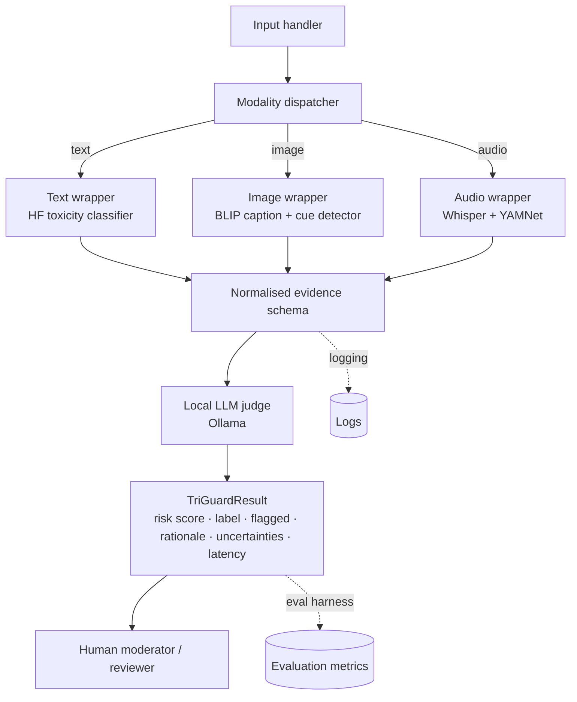

# System Architecture — TriGuard

This document is the full specification of the TriGuard architecture. The project design PDF references it; this file holds the detail.

## 1. Component diagram (Mermaid)



## 2. Layered view

| Layer | Responsibility |
|---|---|
| 1. Input handler | Accept payload (text str, image path/bytes, audio path/bytes); validate types; reject oversized inputs |
| 2. Modality dispatcher | Route each provided modality to its wrapper; skip modalities not present |
| 3. Model wrappers | Each wrapper calls one pre-trained model and returns a normalised evidence object |
| 4. Evidence schema | Pydantic models enforce contract before judge runs |
| 5. Orchestrator / LLM judge | Build prompt, call local LLM, parse + validate JSON output |
| 6. Result builder | Assemble `TriGuardResult`; attach latency + uncertainties |
| 7. Sink | Return JSON via FastAPI or CLI; log; optionally write to disk for evaluation |

## 3. I/O formats

### 3.1 Wrapper inputs
- Text wrapper: `str` (UTF-8, ≤ 8 000 chars).
- Image wrapper: `pathlib.Path | bytes`, formats PNG/JPEG, max edge 1024 px (downscale otherwise).
- Audio wrapper: `pathlib.Path | bytes`, formats WAV/MP3/FLAC, ≤ 60 s (chunked otherwise).

### 3.2 Evidence schemas

```python
class TextEvidence(BaseModel):
    toxicity_score: float   # 0..1
    top_labels: list[str]   # e.g. ["insult", "threat"]
    confidence: float
    raw: dict

class ImageEvidence(BaseModel):
    caption: str
    visual_risk_cues: list[str]  # heuristic tags drawn from caption
    confidence: float
    raw: dict

class AudioEvidence(BaseModel):
    transcript: str
    transcript_confidence: float
    yamnet_tags: list[tuple[str, float]]  # (label, score)
    raw: dict
```

### 3.3 Judge contract

```python
class JudgeInput(BaseModel):
    text: TextEvidence | None
    image: ImageEvidence | None
    audio: AudioEvidence | None

class JudgeOutput(BaseModel):
    risk_score: float                  # 0..1
    risk_label: Literal["safe", "borderline", "harmful"]
    flagged_modalities: list[Literal["text", "image", "audio"]]
    rationale: str                     # ≤ 400 chars, must reference evidence
    uncertainties: list[str]
    recommended_action: Literal["allow", "review", "block"]
```

### 3.4 Final result

```python
class TriGuardResult(JudgeOutput):
    text_evidence: TextEvidence | None
    image_evidence: ImageEvidence | None
    audio_evidence: AudioEvidence | None
    latency_ms: int
    model_versions: dict[str, str]
```

## 4. Component responsibilities

### Model wrappers
- Single-input `analyse()` method.
- Return a normalised evidence object.
- Support **mock mode** (env var `TRIGUARD_MOCK=1`) — return canned outputs for unit tests.
- Avoid loading model weights at import time.
- Catch and log model errors; return an evidence object with `confidence=0` rather than raising.

### Orchestrator (`orchestrator/pipeline.py`)
- Accept optional `text`, `image`, `audio` inputs.
- Call only the wrappers needed.
- Build the `JudgeInput`, hand it to the judge.
- Validate `JudgeOutput`; if invalid, retry once with a stricter prompt; if still invalid, return a `borderline` result with `uncertainties=["judge_output_invalid"]`.
- Attach latency + model versions.

### LLM judge (`models/llm_judge.py`)
- Connect to local Ollama instance (default `http://localhost:11434`).
- Default model: `llama3:8b-instruct-q4`.
- Prompt template: system message defining role + JSON schema; user message containing the structured evidence summary.
- Output parsed against `JudgeOutput`.
- Guardrail: judge must reference at least one piece of evidence in its rationale (regex check); else flag uncertainty.

### Evaluation pipeline (`evaluation/run_eval.py`)
- Runs on saved JSON outputs from the orchestrator.
- Computes per-track metrics (see `evaluation_protocol.md`).
- Saves a timestamped folder under `outputs/evaluation/` with dataset name, n, metrics, config, limitations, failure cases.

## 5. Limitations of this architecture (declared up front)

- The judge is the single point of failure for explainability. If the LLM produces a poor rationale, the system cannot recover.
- Audio scope is bounded to ≤ 60 s clips; long-form audio is out of scope.
- The image wrapper relies on BLIP captions; very abstract visual hate (e.g. coded symbols) may not appear in the caption.
- The system assumes English-language operation in the prototype; multilingual support is planned but not in scope for the Preliminary Report.
- The system is decision-support, not autonomous moderation. The recommended action is advisory.
